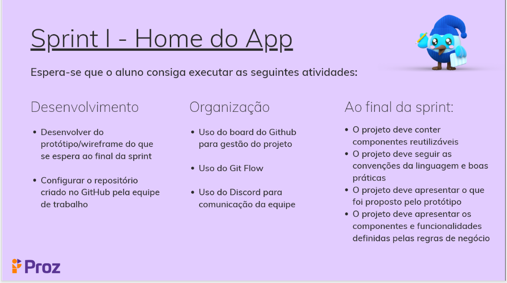

# PIT01GP1 - Projeto Integrador do Curso de Flutter

## Desafio

Desenvolvimento de uma aplicação para gerenciamento de finanças pessoais.

- Entregas:
  - [x] Sprint 0 
  - [x] Sprint I 

[Link da Apresentação PROZ Educação](https://docs.google.com/presentation/d/181Vlhx1l7lmpuS8htd34nlJ9vLXomLDjK2Sc5mJm4JY/edit#slide=id.g1395cdef0a2_0_83 )

## Integrantes

- [Caio Malassise](https://github.com/cmalassise)
- [Lucas Dantas](https://github.com/ldantascruz)
- [Luan Fonseca](https://github.com/Luanftg)
- [Nicolas Kormann](https://github.com/nicolasKormann)

## Solução

- *Dependências Utilizadas*
  - [flutter_credit_card_brazilian]
  - [google_fonts]
  - [flutter_statusbarcolor_ns]
- **Definição da Arquitetura Inicial:**

- **Componentes Desenvolvidos**

- [x] actionAppbar - *ActionAppBar*
- [x] appBar - *AppBar*
- [x] bodyTransaction - *ListTile*
- [x] customBottomAppBar - *BottomAppBar*
- [x] customDrawer - *Drawer*
- [x] myCards - *Cards*
- [x] titleAppBar - *GestureDetector*
- [x] charts - *CustomPaint* and *CustomPainter*

### Referências

- [Flutter](https://flutter.dev/)
- [immais](https://immais.com/)
- [organizze](https://www.organizze.com.br/)
- [mobills](https://www.mobills.com.br/)
