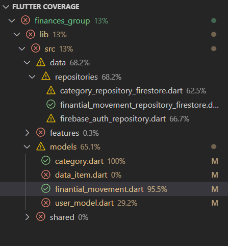
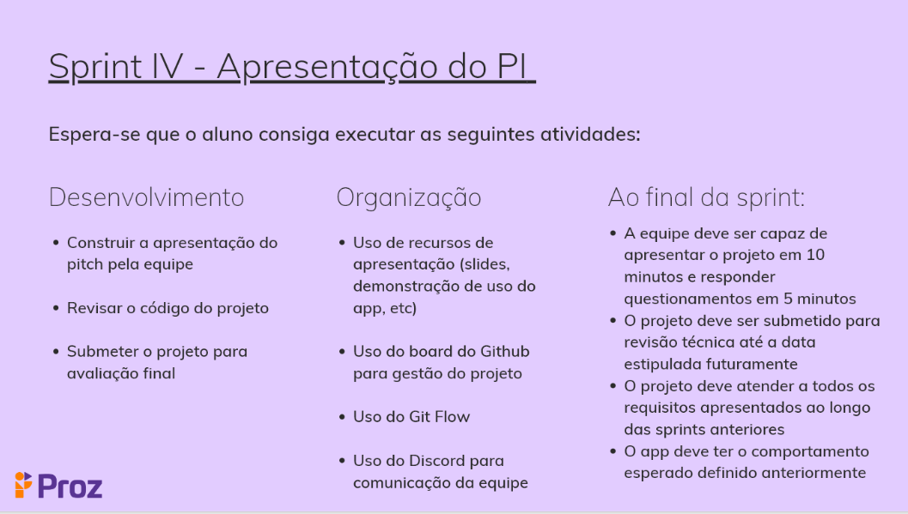

# Finances Group :chart

## PIT01GP1 - Projeto Integrador do Curso de Flutter

## Desafio

Desenvolvimento de uma aplicação mobile para gerenciamento de finanças pessoais.

- *SPRINT IV* - **:star: Testes de Unidade**

- *SPRINT III* - **:star: Firebase Authentication e Cloud Firestore**

<https://user-images.githubusercontent.com/51548623/212443715-c246378c-ccf5-4f73-a84f-ab1c2b659a13.mp4>

- *SPRINT II* - **:star: State Managment**

<https://user-images.githubusercontent.com/51548623/206007012-12474703-7f0f-455a-8cb5-9e53a824fb5c.mp4>

- *SPRINT I* - **:star: HomePage**

<https://user-images.githubusercontent.com/51548623/199126921-9910605f-7132-4856-93fb-44b50c9f5f95.mp4>

- **Entregas:**
- [x] Sprint 0 
- [x] Sprint I 
- [x] Sprint II 
- [x] Sprint III 
*OBS: Os testes foram passados para a **Sprint IV***
- [x] Sprint III 

[Link da Apresentação PROZ Educação](https://docs.google.com/presentation/d/181Vlhx1l7lmpuS8htd34nlJ9vLXomLDjK2Sc5mJm4JY/edit#slide=id.g1395cdef0a2_0_83 )

## Integrantes

- [Caio Malassise](https://github.com/cmalassise)
- [Lucas Dantas](https://github.com/ldantascruz)
- [Luan Fonseca](https://github.com/Luanftg)
- [Nicolas Kormann](https://github.com/nicolasKormann)

## Soluções

### Implementações da Sprint IV

- A implementação de testes revelou a necessidade de refatoração do projeto, no intuito de otimizar o desacoplamento das classes priorizando a independencia das unidades para teste.
- Os teste foram realizados nos repositórios que são responsáveis pela manipulação das entidades/modelos trafegadas pelo app.

### Implementações da Sprint III
  
- [x] CRUD de Movimentação financeira utilizando o [Firebase Cloud Firestore](https://firebase.google.com/docs/firestore/)
- [x] Fluxo de Authenticação utilizando o [Firebase Authentication](https://firebase.google.com/docs/auth)

**Fluxo Desenvolvido para Sprint II**
  

- *Dependências Utilizadas*
- [flutter_credit_card_brazilian](https://pub.dev/packages/flutter_credit_card_brazilian)
- [google_fonts](https://pub.dev/packages/google_fonts)
- [flutter_statusbarcolor_ns](https://pub.dev/packages/flutter_statusbarcolor_ns)
- [cupertino_icons](https://pub.dev/packages/cupertino_icons)
- [path_provider](https://pub.dev/packages/path_provider)
- [mask_text_input_formatter](https://pub.dev/packages/mask_text_input_formatter)
- [shared_preferences](https://pub.dev/packages/shared_preferences)

- **Definição da Arquitetura Inicial:**

- **Avanço da Arquitetura para Features**

### Componentes Desenvolvidos

- Componentes da **HomePage**

- [x] actionAppbar - *ActionAppBar*
- [x] appBar - *AppBar*
- [x] bodyTransaction - *ListTile*
- [x] customBottomAppBar - *BottomAppBar*
- [x] customDrawer - *Drawer*
- [x] myCards - *Cards*
- [x] titleAppBar - *GestureDetector*
- [x] charts - *CustomPaint* and *CustomPainter*
- [x] body_teste - *FutureBuilder*
- [x] customIconVisibility - *IconButton*
- Componentes da **Login-Register**
- [x] custom - *TextFormField*
- Componentes da **Register-Finantial-Movement-Page**
- [x] customSwitch - *Switch*

### Idéias para as próximas Implementações de Funcionalidades

- [ ] :star: ***Lembrete de Registro de Movimentações***

- [x] :star: ***Simulador de Valor Futuro***

- [ ] :star: ***Calculadora do milhão***

#### Protótipo com ideia inicial

[Protótipo com ideia inicial](https://marvelapp.com/project/6493232)

#### Referências

- [Flutter](https://flutter.dev/)
- [immais](https://immais.com/)
- [organizze](https://www.organizze.com.br/)
- [mobills](https://www.mobills.com.br/)
- [FireBase - docs](https://firebase.google.com/docs/)
- [Fake FirebaseFirestor - test - pub.dev](https://pub.dev/packages/fake_cloud_firestore/install)
- [Mocktail - test - pub.dev](https://pub.dev/packages/mocktail)
- [firebase_auth_mocks 0.10.3](https://pub.dev/packages/firebase_auth_mocks)
- [Image Picker - Pub DEV](https://medium.com/unitechie/flutter-tutorial-image-picker-from-camera-gallery-c27af5490b74)