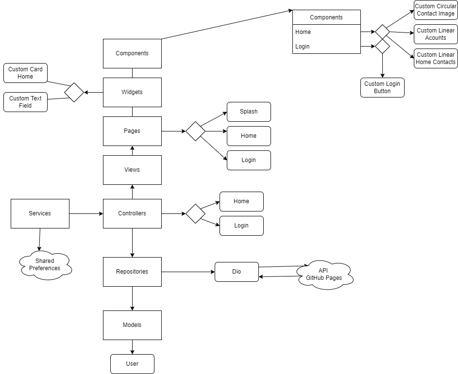

# Aplicativo Sistema Financeiro

## Soluções Implementadas

- :star: Navegação por Rotas
  - [x] Splash
  - [x] Login
  - [x] Home

- :star: fake:"API"  fornecida em:
  - [x] [Git Hub Pages - https://luanftg.github.io/teste-git/finances_api.json](https://luanftg.github.io/teste-git/finances_api.json)

### Widgets Utilizados

[Row](https://api.flutter.dev/flutter/widgets/Row-class.html)
[Column](https://api.flutter.dev/flutter/widgets/Column-class.html)
[Container](https://api.flutter.dev/flutter/widgets/Container-class.html)
[Circular ProgressIndicator Class](https://api.flutter.dev/flutter/material/CircularProgressIndicator-class.html)
[Divider](https://api.flutter.dev/flutter/material/Divider-class.html)
[Elevated Button](https://api.flutter.dev/flutter/material/ElevatedButton-class.html)
[Floating Action Button](https://api.flutter.dev/flutter/material/FloatingActionButton-class.html)
[Scaffold](https://api.flutter.dev/flutter/material/Scaffold-class.html)
[Sized Box](https://api.flutter.dev/flutter/widgets/SizedBox-class.html)
[Stack](https://api.flutter.dev/flutter/widgets/Stack-class.html)
[Text Field](https://api.flutter.dev/flutter/material/TextField-class.html)

### Dependências Utilizadas

[dio 4.0.6](https://pub.dev/packages/dio)
[shared_preferences 2.0.15](https://pub.dev/packages/shared_preferences)
